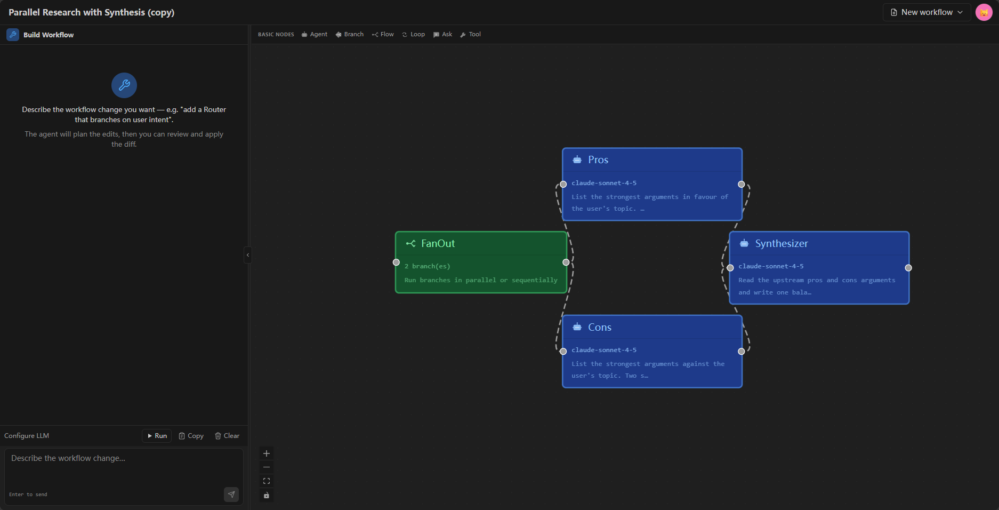

# FlowWeaver

[](https://github.com/ckfanzhe/FlowWeaver/stargazers)
[](LICENSE)
[](https://www.python.org/downloads/)
[](https://www.typescriptlang.org/)


FlowWeaver is an open-source visual builder for [agno](https://github.com/agno-agi/agno)-style agent workflows. Drag-and-drop nodes onto a canvas, wire data flow + tool attachments, run multi-turn workflows in a chat panel, and export the whole thing as a standalone Python file that depends only on agno. Inspired by community projects like **Agnobuilder**, FlowWeaver focuses on a single-engine runtime, declarative node-type definitions, and a friendly chat-driven creation surface.

<p align="center">
  
</p>

## Features

- **Visual orchestration** — React Flow canvas with 6 node kinds (`agent`, `ask`, `branch`, `flow`, `loop`, `tool`) covering executable, control-flow, compound, and tool-source shapes.
- **Tool attachments** — wire HTTP / MCP / function / preset tools to agents via the canvas; the runtime injects them at compile time.
- **Multi-turn chat runtime** — persistent session store with cross-restart durability, HITL (human-in-the-loop) pause/resume, configurable history window, and a chat-builder API that turns natural-language prompts into workflow edits.
- **Declarative node types** — every node is one JSON manifest entry + one strategy class. Adding a node is ~3 files.
- **Python export** — every workflow compiles to a standalone `.py` file that uses only `agno` + stdlib. The export pipeline is byte-stable across runs.
- **Single-engine runtime** — one agno workflow per run. No parallel state machines, no mirror channels, no dual-runtime reconciliation.

## Status

First open-source release. The runtime, IR, serializer, event adapter, chat builder, and the 6-node-type catalog are stable and exported to PyPI-compatible Python. v1.5 includes persistence across process restart.

## Quick start

```bash
# Backend (port 8880)
cd backend
uv sync
uv run uvicorn app.main:app --host 0.0.0.0 --port 8880 --app-dir src --reload

# Frontend (port 5173)
cd frontend
npm install
npm run dev
```

Open http://localhost:5173. The first-time flow has the user identify via email (no password — FlowWeaver is for internal-network deployment).

## Configuring an LLM provider

The runtime reads LLM credentials from the **`LlmPreset` table in the database**, not from `.env` files. Add your provider after the first backend start:

1. Open the app, click the **user menu** (top right) → **Settings**.
2. Open the **LLM Models** tab → **Add preset**.
3. Pick a provider (OpenAI / Anthropic / Google / xAI / OpenAI-compatible), paste your API key, set the model id (e.g. `claude-sonnet-4-5`, `gpt-4o`, `Qwen3-8B`), and Save.
4. Mark the preset as **default** so the runtime uses it for all agents.

The `.env.example` file at the repo root is **only useful for the `real_llm_preset` test fixture** (runs the integration test suite against a real provider). It is NOT read by the runtime API. Do not paste production keys into `.env` expecting them to take effect — the runtime ignores that file for credentials.

For a local vLLM setup, run vLLM on port 8000, then add a preset in the UI:

```text
Provider: OpenAI-compatible
Base URL: http://localhost:8000/v1
API key:  EMPTY                # vLLM ignores this by default
Model:   Qwen3-8B
```

## How it fits together

```
┌──────────────┐     IR + manifest      ┌──────────────────┐
│   Canvas     │  ◀──────────────────▶  │  Python export   │
│ (React Flow) │   drag / drop / wire   │ (Python source)  │
└──────┬───────┘                        └──────────────────┘
       │ SSE
       ▼
┌──────────────┐  agno 2.x workflow    ┌──────────────────┐
│  Runtime API │  ──────────────────▶  │ SQLite + sessions │
│   (FastAPI)  │   event-stream SSE     │  (SQLAlchemy)    │
└──────────────┘                        └──────────────────┘
       ▲
       │ chat-builder API
       │
┌──────────────┐
│  Chat panel  │  natural-language edits → staged diffs → apply
└──────────────┘
```

A single workflow round-trip:

1. The canvas produces an IR (intermediate representation) of nodes + edges.
2. The IR compiles into an `agno.workflow.Workflow` (the only runtime engine).
3. `Wf.run(...)` streams events back to the SSE consumer.
4. The chat panel renders each event as a typed bubble (text / tool_call / tool_result / confirmation / completed / error).
5. `Wf.continue_run(...)` resumes after a HITL gate.

## Adding a node type

The dispatch plumbing (pipeline, tool factories, serializer) is registry-driven and doesn't need to be touched.

```bash
# 1. Edit shared/nodes.manifest.json — add your entry (or `extends: "http"` for a preset).
# 2. (Only if the type is new) Add the strategy class + form component.
# 3. Regenerate the TS union so typecheck stays green:
python scripts/generate_node_types.py
```

See [`shared/nodes.manifest.json`](shared/nodes.manifest.json) for the canonical manifest schema.

## Project layout

```
backend/    # FastAPI + SQLAlchemy + Python orchestration engine
frontend/   # React 18 + React Flow v12 + Zustand + Tailwind
shared/     # Cross-cutting JSON manifests (node types, connection rules)
scripts/    # Repo-level dev / CI utilities
```

## Architecture notes

- **Single-engine runtime** — every run goes through one agno workflow. No parallel state machines, no mirror channels.
- **Declarative node types** — every node is one JSON manifest entry + one strategy class. Adding a node is ~3 files.
- **Two-tier session store** — in-memory hot cache + SQLite cold store. The session survives process restart; cross-restart pause-state surfaces a clean 409 with a re-trigger hint.
- **Chat builder** — natural-language edits flow through a staged diff + strict validation pipeline. Apply is atomic; rollback is automatic on validation failure.

## License

[MIT](./LICENSE) — see [`LICENSE`](LICENSE) for the full text.

## Contributing

See [`CONTRIBUTING.md`](CONTRIBUTING.md) for dev setup, code style, and the conventional-commits format this repo uses.

## Languages

- [English](./README.md)
- [中文](./docs/README.zh-CN.md)