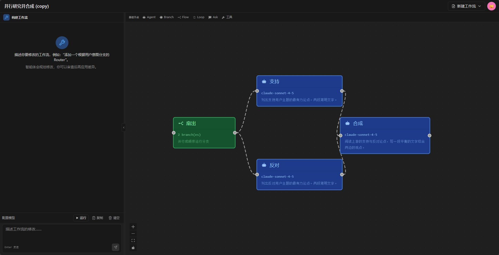

# FlowWeaver

> **用自然语言编织智能体工作流 —— 可视化编排，Python 导出。**

FlowWeaver 是一款开源的 [agno](https://github.com/agno-agi/agno) 风格智能体工作流可视化编辑器。在画布上拖放节点、连接数据流与工具挂载点、在聊天面板里运行多轮工作流，并把整个流程导出为只依赖 agno 的独立 Python 文件。FlowWeaver 受 **Agnobuilder** 等社区项目启发，专注于单引擎运行时、声明式节点类型定义，以及更友好的对话驱动创建体验。

<p align="center">
  
</p>

## 特性

- **可视化编排** —— React Flow 画布，6 种节点类型（`agent`、`ask`、`branch`、`flow`、`loop`、`tool`），覆盖可执行节点、控制流节点、复合节点和工具源节点。
- **工具挂载** —— 通过画布把 HTTP / MCP / function / 预设工具挂到 agent 上，运行时在编译阶段注入。
- **多轮对话运行时** —— 持久化会话存储，支持跨进程重启；支持 HITL（人在环路）暂停/恢复；可配置历史窗口；提供聊天构建器 API，把自然语言提示转换成工作流编辑。
- **声明式节点类型** —— 每个节点对应一个 JSON 清单条目 + 一个 strategy 类。新增一个节点大约 3 个文件。
- **Python 导出** —— 每个工作流都能编译为独立的 `.py` 文件，只依赖 `agno` 和标准库。导出管线多次运行结果字节级稳定。
- **单引擎运行时** —— 每次运行只走一个 agno workflow。无并行状态机、无镜像通道、无双运行时协调。

## 状态

首次开源发布。运行时、IR、序列化器、事件适配器、聊天构建器以及 6 种节点类型目录都已稳定，并导出为可发布到 PyPI 的 Python 包。v1.5 已支持跨进程重启的会话持久化。

## 快速开始

```bash
# 后端（端口 8880）
cd backend
uv sync
uv run uvicorn app.main:app --host 0.0.0.0 --port 8880 --app-dir src --reload

# 前端（端口 5173）
cd frontend
npm install
npm run dev
```

浏览器打开 http://localhost:5173。首次进入时会要求输入邮箱作为身份标识（**没有密码**——FlowWeaver 面向内网部署场景）。

## 配置 LLM 供应商

运行时从数据库里的 **`LlmPreset` 表**读取 LLM 凭据，**不读 `.env` 文件**。后端首次启动后，按以下步骤添加供应商：

1. 打开应用，点击右上角**用户菜单** → **Settings**。
2. 打开 **LLM Models** 标签页 → **Add preset**。
3. 选择供应商（OpenAI / Anthropic / Google / xAI / OpenAI 兼容），粘贴 API Key，填入模型 id（例如 `claude-sonnet-4-5`、`gpt-4o`、`Qwen3-8B`），保存。
4. 把它标记为 **default**，这样所有 agent 都会用它。

仓库根目录下的 `.env.example` 文件**只用于 `real_llm_preset` 测试装置**（用真实供应商跑集成测试）。**运行时 API 不会读取这个文件**。别把生产环境的 Key 贴到 `.env` 里期待它生效——运行时忽略这个文件中的凭据。

如果用本地 vLLM，在 vLLM 启动后（默认端口 8000），在 UI 里添加一个 preset：

```text
Provider:  OpenAI-compatible
Base URL: http://localhost:8000/v1
API key:  EMPTY                # vLLM 默认忽略这个值
Model:    Qwen3-8B
```

## 整体架构

```
┌──────────────┐     IR + manifest      ┌──────────────────┐
│   Canvas     │  ◀──────────────────▶  │  Python export   │
│ (React Flow) │   拖拽 / 放置 / 连线   │  (Python 源文件)  │
└──────┬───────┘                        └──────────────────┘
       │ SSE
       ▼
┌──────────────┐  agno 2.x workflow    ┌──────────────────┐
│  Runtime API │  ──────────────────▶  │ SQLite + sessions│
│   (FastAPI)  │   event-stream SSE     │  (SQLAlchemy)    │
└──────────────┘                        └──────────────────┘
       ▲
       │ chat-builder API
       │
┌──────────────┐
│  Chat panel  │  自然语言编辑 → 分阶段 diff → 应用
└──────────────┘
```

一次工作流的运行流程：

1. 画布产出节点 + 边的 IR（中间表示）。
2. IR 编译成一个 `agno.workflow.Workflow`（唯一运行时引擎）。
3. `Wf.run(...)` 把事件流式推回 SSE 消费端。
4. 聊天面板把每条事件渲染为对应类型的消息气泡（text / tool_call / tool_result / confirmation / completed / error）。
5. `Wf.continue_run(...)` 在 HITL 闸门后恢复执行。

## 新增节点类型

调度管线（pipeline、tool factories、serializer）是注册表驱动的，添加新类型时不需要改它们。

```bash
# 1. 编辑 shared/nodes.manifest.json —— 加一个条目（或对预设用 `extends: "http"`）。
# 2. （仅当是全新类型时）添加 strategy 类和表单组件。
# 3. 重新生成 TS 联合类型，让 typecheck 保持绿：
python scripts/generate_node_types.py
```

参考 [`shared/nodes.manifest.json`](shared/nodes.manifest.json) 的清单 schema。

## 项目结构

```
backend/    # FastAPI + SQLAlchemy + Python 编排引擎
frontend/   # React 18 + React Flow v12 + Zustand + Tailwind
shared/     # 横切关注点的 JSON 清单（节点类型、连接规则）
scripts/    # 仓库级开发 / CI 工具
```

## 架构要点

- **单引擎运行时** —— 每次运行只走一个 agno workflow。无并行状态机、无镜像通道。
- **声明式节点类型** —— 每个节点对应一个 JSON 清单条目 + 一个 strategy 类。新增一个节点大约 3 个文件。
- **双层会话存储** —— 内存热缓存 + SQLite 冷存储。会话跨进程重启可恢复；跨重启的暂停状态会以 409 + 重新触发提示返回。
- **聊天构建器** —— 自然语言编辑走"分阶段 diff + 严格校验"管线。应用是原子的；校验失败会自动回滚。

## 许可证

[MIT](./LICENSE) —— 见 [`LICENSE`](LICENSE) 全文。

## 贡献

见 [`CONTRIBUTING.md`](../CONTRIBUTING.md) 了解开发环境配置、代码风格和本仓库使用的 conventional-commits 格式。

## 语言版本

- [English](../README.md)
- [中文](./README.zh-CN.md)